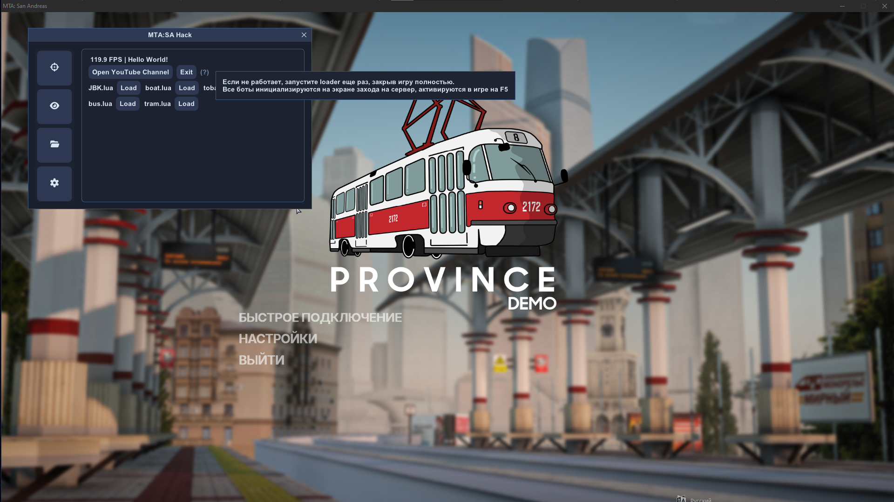

# 🎯 Cheat MTA: Province

  
  
    
  
  

---

## ✨ Основные возможности

### 🔫 AimBot (Авто-прицел)
- Полностью настраиваемый Aimbot
- Настройка **FOV** (поле зрения прицела)
- Выбор костей для аима:
  - Head
  - Neck
  - Chest
  - Left Shoulder
  - Right Shoulder
  - Left Elbow
  - Right Elbow
  - Pelvis
  - Left Knee
  - Right Knee
- Настройка **плавности аима** (Smooth)
- Проверка видимости игрока (**Visible Check**)
- Игнор тиммейтов
- Ограничение по дистанции

### 👁️ Visuals (Визуалы / ESP)
- Включение / выключение ESP
- Показ превью
- Типы боксов:
  - 2D Box
  - 3D Box
  - Corner Box
  - Filled Box
- Настройка цветов всех элементов
- **Skeleton** (скелетон)
- Имя игроков
- Здоровье
- Оружие
- Дистанция
- Линии до игроков (**Snaplines**)

### 🛠️ Дополнительные функции
- **Serial Changer** - смена серийного номера
- 2 встроенных бота:
  - Бот на ЖБК
  - Бот на лодочные прогулки

---

## 🚀 Установка и запуск

1. Скачайте последнюю версию чита по ссылке выше
2. Запустите MTA: Province
3. Запустите чит (обычно как администратор)
4. Войдите в игру и наслаждайтесь

> **Рекомендуется** запускать чит **перед** запуском игры.

---

## ⚙️ Настройка

Все функции имеют удобное меню с горячими клавишами.  
